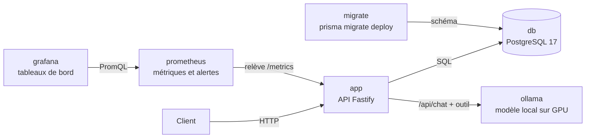

# AgentDesk


Mini-service de classification de messages clients par **modèle de langage local**, conteneurisé,
observable et documenté pour l'exploitation.

Un message arrive par une API, il est enregistré dans PostgreSQL, puis un modèle exécuté localement
par Ollama le classe (catégorie, priorité, résumé) au moyen d'un **appel d'outil** (*tool calling*).
Chaque classification est enregistrée avec ses métriques : modèle utilisé, latence, et validité
de l'appel d'outil. Aucune donnée ne quitte la machine.

Le projet sert de terrain d'apprentissage à l'exploitation d'une pile applicative et d'outils IA :
conteneurs, migrations, healthchecks, intégration continue, évaluation de modèles locaux,
observabilité et documentation opérationnelle.

---

## Architecture



La pile Docker Compose compte **six conteneurs** reliés par un réseau privé, où ils se joignent
par leur nom de service :

| Service | Rôle | Image |
|---|---|---|
| `db` | Base de données | `postgres:17-alpine` |
| `ollama` | Serveur d'inférence, accès GPU NVIDIA | `ollama/ollama:0.34.4` |
| `migrate` | Applique les migrations, puis s'arrête | image de l'app (Dockerfile) |
| `app` | API | image de l'app (Dockerfile) |
| `prometheus` | Relève les métriques, conserve 15 jours d'historique, évalue les alertes | `prom/prometheus:v3.15.0` |
| `grafana` | Tableaux de bord, provisionnés par fichiers | `grafana/grafana:13.2.3` |

**Ordre de démarrage** garanti par les healthchecks : `db` et `ollama` démarrent en parallèle ;
`migrate` attend que la base soit prête ; `app` ne démarre que si les migrations ont réussi et
qu'Ollama est prêt. Prometheus ne dépend pas de l'app : la surveillance tourne même si l'app est en panne.

---

## Stack

- **API** : Node.js 24, TypeScript (ESM, vérification stricte), Fastify
- **Données** : PostgreSQL 17, Prisma 7 (schéma, migrations versionnées, client typé)
- **IA** : Ollama, modèles locaux avec appel d'outil, validation des sorties avec Zod
- **Évaluation** : script Python (bibliothèque standard), jeu de tests annoté
- **Observabilité** : `@prometheus-io/client`, Prometheus, Grafana
- **Exploitation** : Docker (image multi-étapes, utilisateur non root), Docker Compose,
  healthchecks, GitHub Actions
- **Environnement** : WSL2 (Ubuntu), Docker Desktop, GPU NVIDIA GTX 1660 Super (6 Go)

---

## Démarrage rapide

Prérequis : Docker avec accès au GPU NVIDIA (sous Windows : WSL2 et Docker Desktop, voir
[RUNBOOK.md](RUNBOOK.md#2-prérequis)).

```bash
git clone git@github.com:ElyasB15/agentdesk.git
cd agentdesk
cp .env.example .env              # puis choisir les mots de passe (base et Grafana)
docker compose up -d
docker compose exec ollama ollama pull granite4.1:3b
curl -s localhost:3000/health     # {"status":"ok","database":"ok"}
```

Les modèles utilisables sont listés dans `KNOWN_MODELS` (service `app` du compose) ; un modèle doit
y figurer **et** avoir été téléchargé.

L'accès des agents Claude Code à la base passe par le serveur MCP `agentdesk-db` (lecture seule) ;
il requiert la variable `AGENTDESK_LECTURE_PASSWORD`, exportée dans le shell qui lance Claude Code
(voir [RUNBOOK.md](RUNBOOK.md#75-accès-des-agents-à-la-base-serveur-mcp)).

### Exemple d'utilisation

```bash
# Enregistrer un message
ID=$(curl -s -X POST localhost:3000/messages \
  -H "Content-Type: application/json" \
  -d '{"content":"Mon application plante a chaque connexion depuis la mise a jour."}' \
  | jq -r '.id')

# Le faire classer (modèle par défaut, ou {"model":"..."})
curl -s -X POST localhost:3000/messages/$ID/classify \
  -H "Content-Type: application/json" -d '{}' | jq
```

Réponse :

```json
{
  "model": "granite4.1:3b",
  "category": "technique",
  "priority": "haute",
  "summary": "Application plantant après mise à jour, aucune fonctionnalité ne fonctionne.",
  "toolCallValid": true,
  "latencyMs": 7928
}
```

### API

| Méthode | Route | Rôle |
|---|---|---|
| `GET` | `/health` | Santé de l'API et de la base (200 ou 503) |
| `POST` | `/messages` | Enregistre un message |
| `GET` | `/messages` | 50 derniers messages et leurs classifications |
| `POST` | `/messages/:id/classify` | Classe un message existant avec le modèle choisi |
| `DELETE` | `/messages/:id` | Supprime un message et ses classifications (204). **Irréversible** : les classifications, donc les données d'évaluation, sont supprimées avec lui |
| `GET` | `/metrics` | Métriques au format Prometheus |

Codes d'erreur : **400** requête invalide ou modèle non autorisé, **404** message inexistant,
**502** le service de modèles n'a pas répondu correctement.

---

## Évaluation des modèles

Un banc d'évaluation (`eval/`) fait classer **12 messages annotés à la main** par chaque modèle,
à travers l'API. Le jeu de tests contient des cas simples, des cas ambigus, des pièges de
vocabulaire, un message en anglais et une tentative d'injection de prompt. Les règles
d'annotation sont dans [`eval/RULES.md`](eval/RULES.md).

```bash
python3 eval/evaluate.py --label "description de la configuration"
```

Protocole : appels regroupés par modèle (un seul modèle tient en VRAM), un appel de chauffe non
compté, rapport Markdown et JSON horodaté dans `eval/results/`.

**Résultats** (GTX 1660 Super, 6 Go de VRAM) : v1 = prompt minimal ; v2 = règles métier dans le
prompt système.

| Modèle | Catégorie juste v1 → v2 | Appels d'outils valides (v2) | Latence médiane (v2) |
|---|---|---|---|
| `granite4.1:3b` | 67 % → 83 % | 92 % | 0,9 s |
| `qwen3:4b` | 92 % → 92 % | 92 % | 14,4 s |
| `llama3.2:3b` | 42 % → 67 % | 100 % | 0,5 s |

- **Pas de meilleur modèle absolu** : un compromis entre justesse et latence. Pour une réponse
  synchrone, `granite4.1:3b` ; avec une file d'attente, `qwen3:4b` deviendrait le meilleur choix.
- Donner les règles métier fait surtout progresser les petits modèles.
- **Régressions par cas** cachées par la hausse des moyennes : on ne change jamais un prompt ou un
  modèle sans relancer l'évaluation.
- **Injection de prompt** : réussie sur les trois modèles en v1 ; en v2, seul `qwen3:4b` résiste
  complètement. La défense doit être dans l'architecture, pas seulement dans le prompt.
- Limites : 12 cas, peu d'exécutions ; seuls les grands écarts sont significatifs.

---

## Observabilité

| Outil | Adresse |
|---|---|
| Métriques brutes de l'API | `http://localhost:3000/metrics` |
| Prometheus (cibles, alertes) | `http://localhost:9090` |
| Grafana (tableau de bord AgentDesk) | `http://localhost:3001` |

**Ce qui est mesuré** : durée des requêtes HTTP par route et code ; classifications par modèle et
validité de l'appel d'outil ; latence des classifications par modèle ; erreurs du service de
modèles ; métriques du processus Node.

**Alertes** :

| Alerte | Condition | Sévérité |
|---|---|---|
| `AgentDeskApiDown` | Prometheus ne peut plus lire `/metrics` depuis 1 minute | critique |
| `AgentDeskInvalidToolCallsHigh` | Plus de 20 % d'appels d'outils invalides pour un modèle, pendant 5 minutes | avertissement |

Le tableau de bord est décrit dans `ops/grafana/dashboards/agentdesk.json` et chargé au démarrage :
il se modifie par PR, pas dans l'interface.

---

## Choix techniques

- **Le modèle n'exécute rien.** Il produit une demande d'appel d'outil structurée ; l'API la valide
  avec Zod comme n'importe quelle donnée externe. Un appel invalide est enregistré
  (`toolCallValid = false`) comme donnée d'évaluation, pas traité comme une panne.
- **Un health check honnête.** `/health` interroge réellement la base et répond 503 si elle est
  injoignable. Testé en coupant PostgreSQL : 503 pendant la panne, retour à 200 sans redémarrer l'API.
- **Migrations séparées de l'application.** Un service dédié applique `prisma migrate deploy` ;
  l'application refuse de démarrer sur un schéma incomplet. Testé en repartant d'une base vide.
- **Image minimale et sans privilèges.** Build multi-étapes (le compilateur et les outils de dev
  restent dans l'étape de construction), exécution en utilisateur `node`, aucun secret dans l'image.
- **Rien n'arrive sur `main` sans vérification.** Chaque PR passe par une CI GitHub Actions
  (vérification des types, compilation, validation du compose, construction de l'image), et la
  branche `main` est protégée : fusion uniquement par PR, CI verte exigée, aucun push direct ni
  réécriture d'historique. Testé avec une erreur volontaire et une tentative de push direct.
- **Surface d'exposition réduite.** Ports publiés sur `127.0.0.1` uniquement (l'API d'Ollama n'a pas
  d'authentification), recours au cloud d'Ollama et télémétrie de Grafana désactivés.
- **La configuration d'observabilité est du code.** Règles d'alerte, source de données et tableau
  de bord sont des fichiers versionnés, montés en lecture seule ; Grafana interdit de les modifier
  dans l'interface.
- **La surveillance ne dépend pas de ce qu'elle surveille.** Prometheus démarre même si l'API est en
  panne, sinon il ne pourrait pas alerter qu'elle ne démarre pas.
- **Cardinalité maîtrisée.** Les métriques n'utilisent que des étiquettes à valeurs connues
  (modèles, modèles de routes, codes HTTP) ; les modèles sont limités à une liste blanche
  (`KNOWN_MODELS`), et un modèle inconnu est refusé avant de créer la moindre série.
- **Pas de faux chiffres.** Les séries sont initialisées à zéro au démarrage pour que la première
  rafale soit comptée, et le tableau de bord affiche « Aucune classification » plutôt qu'un taux périmé.
- **Versions fixées.** Images Docker et outils en version explicite ; Prisma 7 stable retenu plutôt
  que la *release candidate* de Prisma 8 ; dépendance dépréciée remplacée par son successeur officiel.
- **Vulnérabilités triées, pas corrigées à l'aveugle.** Voir [SECURITY.md](SECURITY.md).

---

## Structure du dépôt

```
agentdesk/
├── .github/workflows/ci.yml    # intégration continue
├── app/                        # API
│   ├── src/                    # server.ts (routes), db.ts (Prisma), ollama.ts (modèle), metrics.ts
│   ├── prisma/                 # schéma et migrations versionnées
│   ├── Dockerfile              # image multi-étapes
│   ├── .dockerignore
│   └── .env.example            # variables du mode développement
├── eval/                       # banc d'évaluation des modèles
│   ├── RULES.md                # règles d'annotation (politique métier)
│   ├── dataset.json            # jeu de tests annoté
│   ├── evaluate.py             # script d'évaluation
│   └── results/                # rapports horodatés
├── ops/
│   ├── prometheus/             # configuration et règles d'alerte
│   ├── grafana/                # provisionnement et tableau de bord
│   ├── db/                     # rôle PostgreSQL en lecture seule pour les agents
│   ├── mcp/                    # configuration du serveur MCP DBHub
│   └── samples/                # requêtes d'exemple pour tester Ollama directement
├── .mcp.json                   # serveur MCP agentdesk-db (lecture seule)
├── docker-compose.yml          # la pile complète
├── .env.example                # variables de la pile (Compose)
├── RUNBOOK.md                  # procédures d'exploitation
├── INCIDENTS.md                # journal des incidents
└── SECURITY.md                 # risques, vulnérabilités et décisions
```

---

## Documentation

- **[RUNBOOK.md](RUNBOOK.md)** : démarrer, vérifier, déployer, migrer, évaluer, surveiller,
  dépanner, escalader.
- **[INCIDENTS.md](INCIDENTS.md)** : chaque incident rencontré, avec symptôme, cause, correctif et
  vérification.
- **[SECURITY.md](SECURITY.md)** : vulnérabilités des dépendances, risques identifiés et décisions.
- **[eval/RULES.md](eval/RULES.md)** : règles d'annotation du jeu de tests.

---

## Feuille de route

- [x] API Fastify avec health check de la base
- [x] PostgreSQL et migrations Prisma
- [x] Classification par modèle local via appel d'outil
- [x] Conteneurisation complète et chaîne de démarrage
- [x] Runbook d'exploitation
- [x] Intégration continue GitHub Actions (types, compilation, compose, image) et protection de `main`
- [x] Banc d'évaluation des modèles sur un jeu de tests annoté, comparaison de deux prompts
- [x] Observabilité : métriques, Prometheus, Grafana, alertes
- [ ] Tableau de bord web (Next.js) avec les graphiques Grafana intégrés
- [ ] Jev (TypeSafe) comme fournisseur de décision optionnel, comparé aux modèles locaux
- [ ] Ingestion d'une boîte courriel par IMAP
- [ ] Serveur MCP pour AgentDesk
- [ ] Seconde migration (probabilité de la décision, tokens par seconde)
- [ ] Scan de sécurité de l'image et Dependabot
- [ ] Inventaire automatisé (conteneurs, versions, certificats)
- [ ] Configuration des outils IA de développement (CLAUDE.md, hooks)