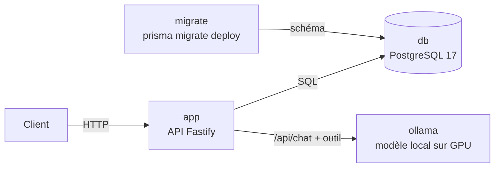

# AgentDesk


Mini-service de classification de messages clients par **modèle de langage local**, conteneurisé
et documenté pour l'exploitation.

Un message arrive par une API, il est enregistré dans PostgreSQL, puis un modèle exécuté localement
par Ollama le classe (catégorie, priorité, résumé) au moyen d'un **appel d'outil** (*tool calling*).
Chaque classification est enregistrée avec ses métriques : modèle utilisé, latence, et validité
de l'appel d'outil. Aucune donnée ne quitte la machine.

Le projet sert de terrain d'apprentissage à l'exploitation d'une pile applicative et d'outils IA :
conteneurs, migrations, healthchecks, évaluation de modèles locaux et documentation opérationnelle.

---

## Architecture



La pile Docker Compose compte **quatre conteneurs** reliés par un réseau privé :

| Service | Rôle | Image |
|---|---|---|
| `db` | Base de données | `postgres:17-alpine` |
| `ollama` | Serveur d'inférence, accès GPU NVIDIA | `ollama/ollama:0.34.4` |
| `migrate` | Applique les migrations, puis s'arrête | image de l'app (Dockerfile) |
| `app` | API | image de l'app (Dockerfile) |

**Ordre de démarrage** garanti par les healthchecks : `db` et `ollama` démarrent en parallèle ;
`migrate` attend que la base soit prête ; `app` ne démarre que si les migrations ont réussi et
qu'Ollama est prêt.

---

## Stack

- **API** : Node.js 24, TypeScript (ESM, vérification stricte), Fastify
- **Données** : PostgreSQL 17, Prisma 7 (schéma, migrations versionnées, client typé)
- **IA** : Ollama, modèles locaux avec appel d'outil, validation des sorties avec Zod
- **Exploitation** : Docker (image multi-étapes, utilisateur non root), Docker Compose,
  healthchecks
- **Environnement** : WSL2 (Ubuntu), Docker Desktop, GPU NVIDIA GTX 1660 Super (6 Go)
- **Rien n'arrive sur `main` sans vérification.** Chaque PR passe par une CI GitHub Actions
  (vérification des types, compilation, validation du compose, construction de l'image), et la
  branche `main` est protégée : fusion uniquement par PR, CI verte exigée, aucun push direct ni
  réécriture d'historique. Testé avec une erreur volontaire et une tentative de push direct.

---

## Démarrage rapide

Prérequis : Docker avec accès au GPU NVIDIA (sous Windows : WSL2 et Docker Desktop, voir
[RUNBOOK.md](RUNBOOK.md#2-prérequis)).

```bash
git clone git@github.com:ElyasB15/agentdesk.git
cd agentdesk
cp .env.example .env              # puis choisir un mot de passe
docker compose up -d
docker compose exec ollama ollama pull granite4.1:3b
curl -s localhost:3000/health     # {"status":"ok","database":"ok"}
```

### Exemple d'utilisation

```bash
# Enregistrer un message
ID=$(curl -s -X POST localhost:3000/messages \
  -H "Content-Type: application/json" \
  -d '{"content":"Mon application plante a chaque connexion depuis la mise a jour."}' \
  | jq -r '.id')

# Le faire classer (modèle par défaut, ou {"model":"..."})
curl -s -X POST localhost:3000/messages/$ID/classify \
  -H "Content-Type: application/json" -d '{}' | jq
```

Réponse :

```json
{
  "model": "granite4.1:3b",
  "category": "technique",
  "priority": "haute",
  "summary": "Application plantant après mise à jour, aucune fonctionnalité ne fonctionne.",
  "toolCallValid": true,
  "latencyMs": 7928
}
```

### API

| Méthode | Route | Rôle |
|---|---|---|
| `GET` | `/health` | Santé de l'API et de la base (200 ou 503) |
| `POST` | `/messages` | Enregistre un message |
| `GET` | `/messages` | 50 derniers messages et leurs classifications |
| `POST` | `/messages/:id/classify` | Classe un message existant avec le modèle choisi |

Codes d'erreur : **400** requête invalide, **404** message inexistant, **502** le service de
modèles n'a pas répondu correctement.

---

## Choix techniques

- **Le modèle n'exécute rien.** Il produit une demande d'appel d'outil structurée ; l'API la valide
  avec Zod comme n'importe quelle donnée externe. Un appel invalide est enregistré
  (`toolCallValid = false`) comme donnée d'évaluation, pas traité comme une panne.
- **Un health check honnête.** `/health` interroge réellement la base et répond 503 si elle est
  injoignable. Testé en coupant PostgreSQL : 503 pendant la panne, retour à 200 sans redémarrer l'API.
- **Migrations séparées de l'application.** Un service dédié applique `prisma migrate deploy` ;
  l'application refuse de démarrer sur un schéma incomplet. Testé en repartant d'une base vide.
- **Image minimale et sans privilèges.** Build multi-étapes (le compilateur et les outils de dev
  restent dans l'étape de construction), exécution en utilisateur `node`, aucun secret dans l'image.
- **Surface d'exposition réduite.** Ports publiés sur `127.0.0.1` uniquement (l'API d'Ollama n'a pas
  d'authentification), recours au cloud d'Ollama désactivé (`OLLAMA_NO_CLOUD`).
- **Versions fixées.** Images Docker et outils en version explicite ; Prisma 7 stable retenu plutôt
  que la *release candidate* de Prisma 8.
- **Vulnérabilités triées, pas corrigées à l'aveugle.** Voir [SECURITY.md](SECURITY.md).

---

## Premières observations sur les modèles

Même message, trois modèles, sur GTX 1660 Super (6 Go de VRAM) :

| Modèle | Appel d'outil valide | Catégorie proposée |
|---|---|---|
| `granite4.1:3b` | ✅ | facturation |
| `qwen3:4b` | ✅ | livraison |
| `llama3.2:3b` | ✅ | livraison |

- Les trois respectent le protocole d'outils, mais **divergent sur la catégorie** d'un message
  ambigu (livraison ratée et demande de remboursement). Évaluer la justesse demande un jeu de tests
  annoté à la main, avec des règles métier explicites.
- **Un seul modèle tient en VRAM à la fois** : alterner entre modèles impose un rechargement à
  chaque appel. Latence à froid : 5 à 8 s ; à chaud : environ 0,7 s.
- `qwen3:4b` est le plus lent (raisonnement interne avant l'appel d'outil).

---

## Structure du dépôt

```
agentdesk/
├── .github/workflows/ci.yml    # intégration continue
├── app/                        # API
│   ├── src/                    # server.ts (routes), db.ts (Prisma), ollama.ts (client du modèle)
│   ├── prisma/                 # schéma et migrations versionnées
│   ├── Dockerfile              # image multi-étapes
│   └── .dockerignore
├── ops/samples/                # requêtes d'exemple pour tester Ollama directement
├── docker-compose.yml          # la pile complète
├── RUNBOOK.md                  # procédures d'exploitation
├── INCIDENTS.md                # journal des incidents
└── SECURITY.md                 # vulnérabilités connues et décisions
```

---

## Documentation

- **[RUNBOOK.md](RUNBOOK.md)** : démarrer, vérifier, déployer, migrer, dépanner, escalader.
- **[INCIDENTS.md](INCIDENTS.md)** : chaque incident rencontré, avec symptôme, cause, correctif et
  vérification.
- **[SECURITY.md](SECURITY.md)** : vulnérabilités des dépendances, analyse d'exploitabilité et
  décisions.

---

## Feuille de route

- [x] API Fastify avec health check de la base
- [x] PostgreSQL et migrations Prisma
- [x] Classification par modèle local via appel d'outil
- [x] Conteneurisation complète et chaîne de démarrage
- [x] Runbook d'exploitation
- [x] Intégration continue GitHub Actions (vérification des types, build de l'image, scan de sécurité, Dependabot) et protection de `main`
- [ ] Script d'évaluation des modèles sur un jeu de tests annoté
- [ ] Seconde migration (`tokensPerSec`) pour faire évoluer un schéma existant
- [ ] Observabilité : métriques, Prometheus, Grafana, alertes
- [ ] Inventaire automatisé (conteneurs, versions, certificats)
- [ ] Configuration des outils IA de développement (CLAUDE.md, serveur MCP, hook)
- [ ] Scan de sécurité de l'image et Dependabot